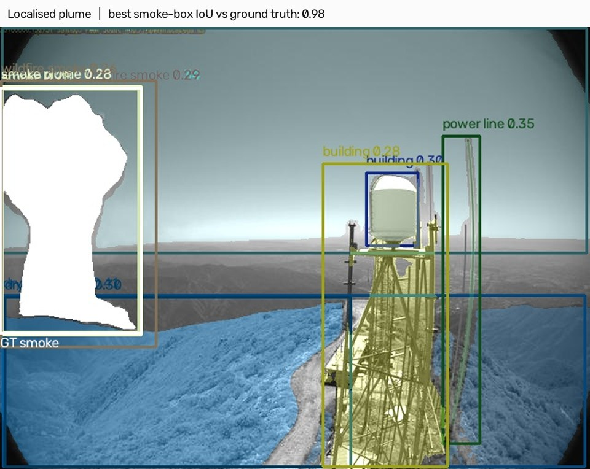
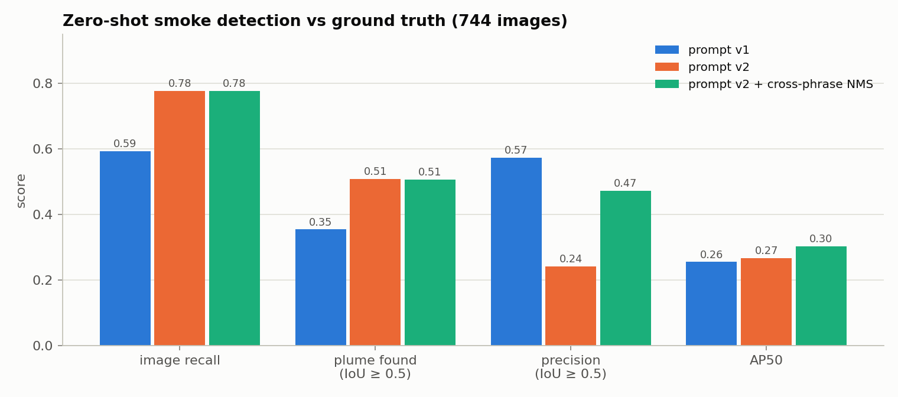
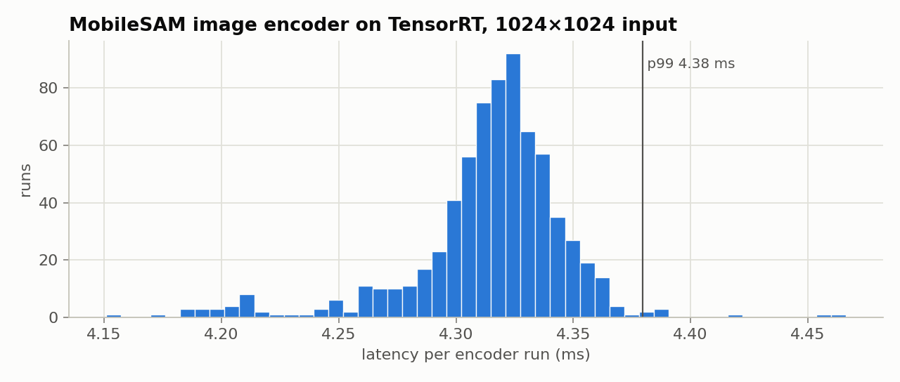
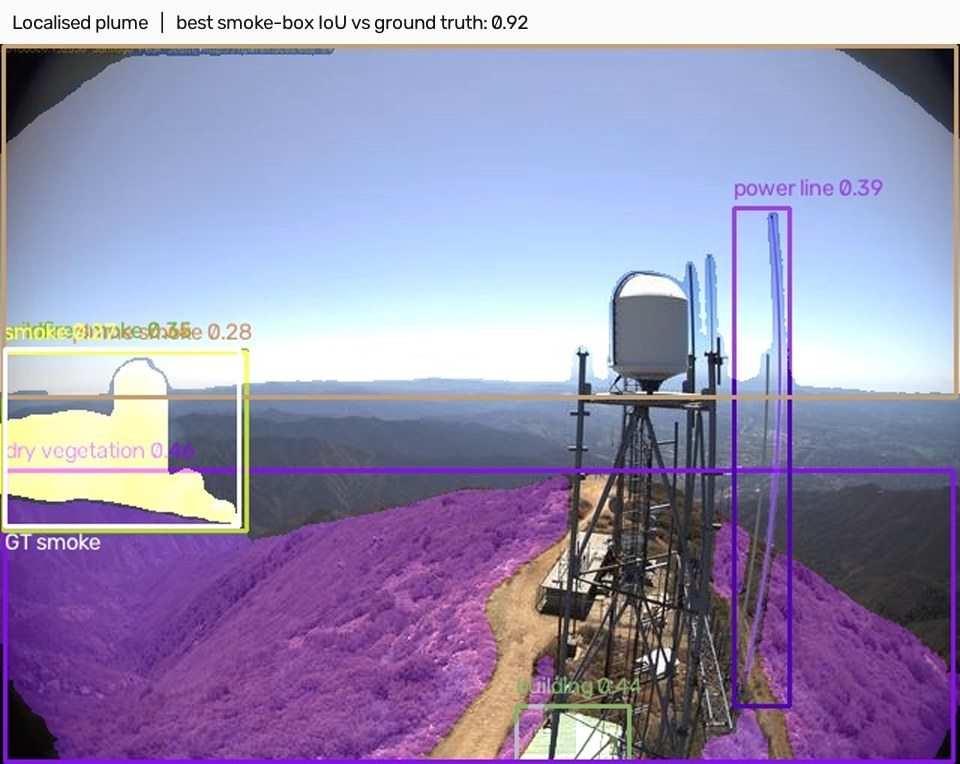
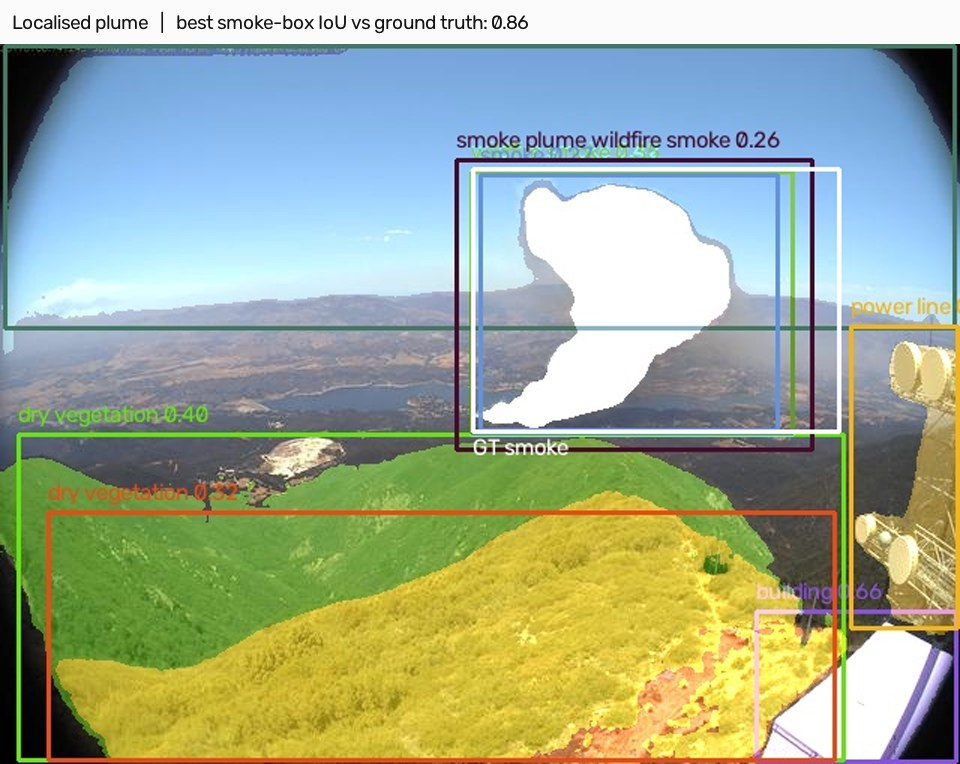
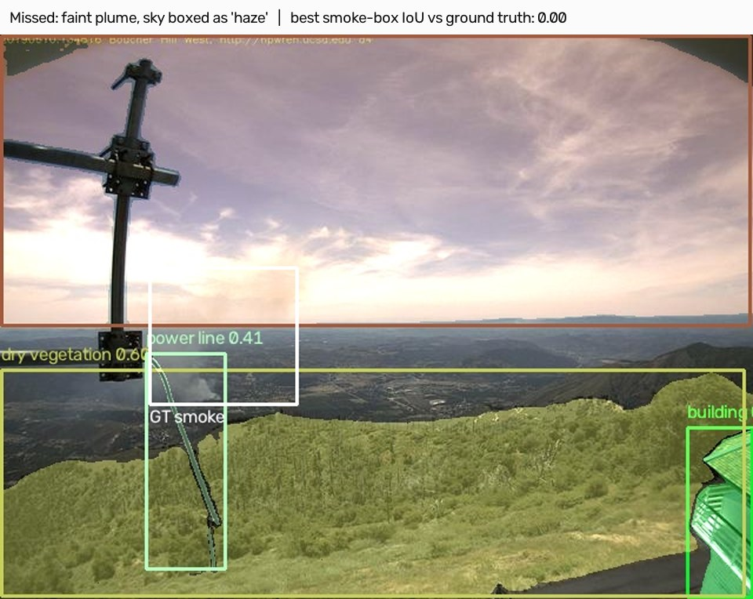
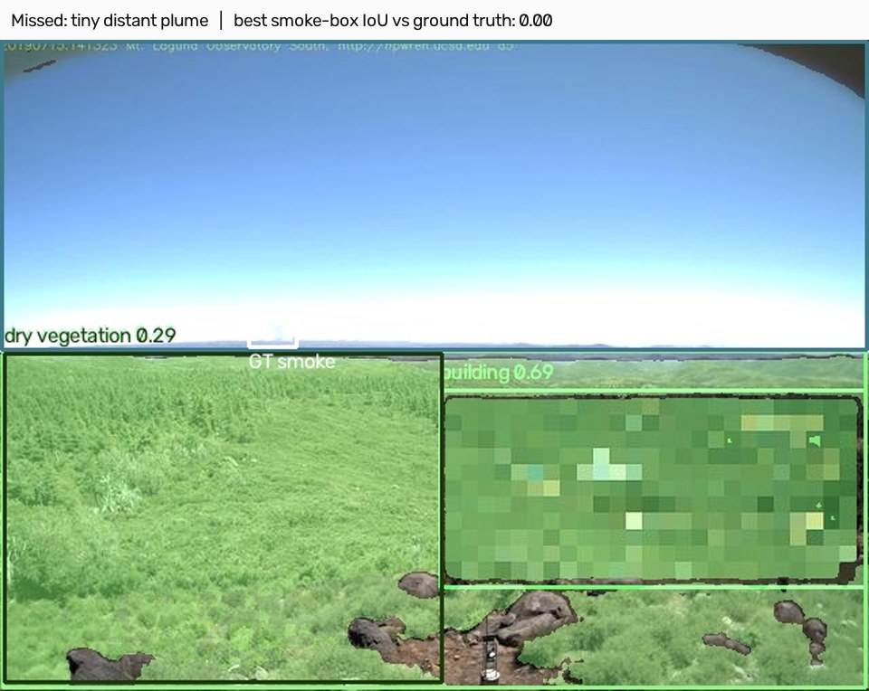
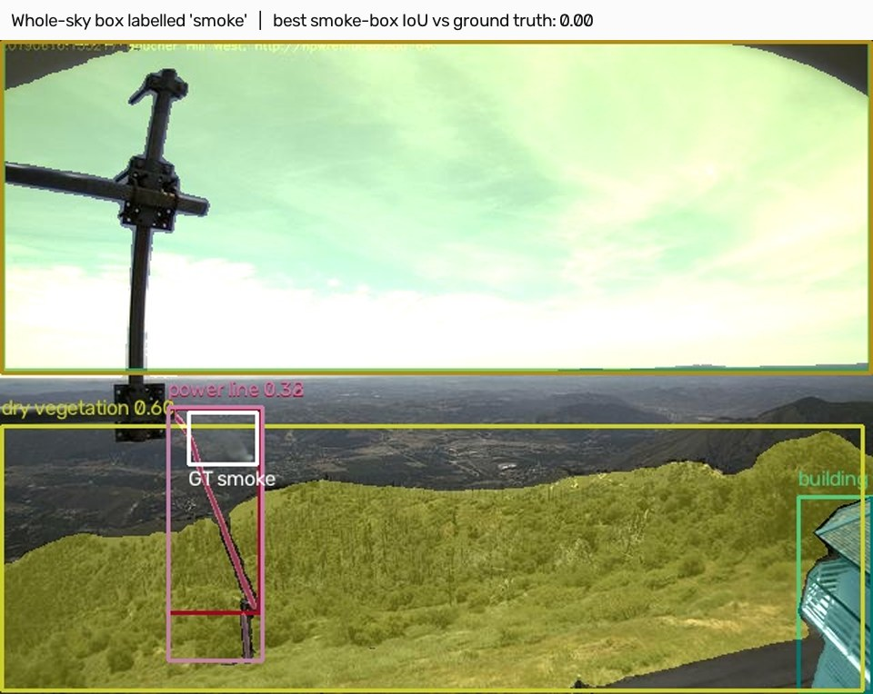
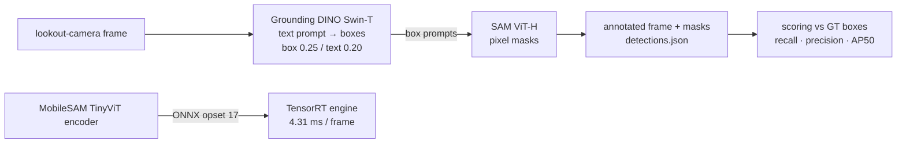

# Zero-Shot Wildfire Scene Understanding (Grounding DINO + SAM → MobileSAM on TensorRT)

A foundation-model pipeline for fire-lookout cameras that segments smoke, haze, dry vegetation, power lines and buildings from a **text prompt**, with no task-specific training. The segmentation encoder is re-targeted to the edge by exporting **MobileSAM to TensorRT**. The pipeline is **scored against ground-truth smoke boxes**, so every claim below is measured.

<p align="center"></p>
<sub>Prompt-v2 output (masks and boxes) with the annotated plume in white. Each example below is its own image.</sub>

## Results (744 HPWREN images, one annotated plume each)

| | Prompt v1 | Prompt v2 (+ synonyms) | v2 + cross-phrase NMS |
|---|---|---|---|
| Images with any smoke detection | 59.3% | **77.7%** | 77.7% |
| Plume localised (IoU ≥ 0.5) | 35.5% | **50.8%** | 50.7% |
| Precision of smoke boxes (IoU ≥ 0.5) | **57.4%** | 24.2% | 47.3% |
| AP50 | 0.255 | 0.267 | **0.304** |

<p align="center">
  
  
</p>

- **Prompt engineering trades precision for recall.** Adding smoke synonyms finds 15 points more plumes, but each synonym boxes the same plume again. A cross-phrase NMS step recovers most of the precision and gives the best AP50.
- **Failure modes.** Small, distant or faint plumes are missed or swallowed by a whole-sky `haze` box. No plume is mislabelled as another class.

<p align="center">
  
  
</p>
<p align="center">
  
  
</p>
<p align="center"></p>

- **Edge path.** The MobileSAM image encoder runs in **4.31 ms** per 1024×1024 frame on TensorRT (mean over 698 runs, p99 4.38 ms). The engine is built from the FP32 graph.

The full walkthrough is in **[wildfire_smoke_zero_shot.ipynb](wildfire_smoke_zero_shot.ipynb)**. [docs/limitations.md](docs/limitations.md) records the scoping decisions.

## How it works



## What the packaging review changed

The original demo video drew a smoke "trajectory" across frames and overlaid "TensorRT: 232 FPS". Neither holds on this dataset:
- The 744 images come from many cameras and days, so consecutive frames are unrelated.
- 232 FPS is the MobileSAM encoder alone, while the frames were produced by Grounding DINO + SAM ViT-H in PyTorch.

The video is therefore not presented as a result (see notebook section 5). Tracking needs a real HPWREN time-lapse sequence.

## Repository layout

```
wildfire_smoke_zero_shot.ipynb   walkthrough: data, zero-shot pipeline, GT scoring, TensorRT export, lessons learned
src/detect_and_segment.py        Grounding DINO -> SAM pipeline, writes annotated frames + detections.json
src/eval_against_gt.py           scoring against the Pascal-VOC smoke boxes (recall, hit@IoU, precision, AP50)
src/export_onnx.py               MobileSAM image encoder -> ONNX
src/export_and_build.sh          ONNX -> TensorRT engine with trtexec (+ per-run timings)
src/benchmark.py                 PyTorch vs TensorRT encoder benchmark (not yet run)
src/load_sequence.py, src/track_and_render.py   frame loader and centroid-trajectory renderer
results/figures/examples/        one image per example case (prompt-v2 output + ground-truth plume)
results/metrics/                 detections (v1, v2), GT boxes, summary scores, TensorRT timings
docs/limitations.md              scoping and measured limitations
```

## Quick start

```bash
pip install -r requirements.txt
# data: AI For Mankind bounding-box set v1 (744 images) -> data/annotated_bounding_box_hpwren/{images,xmls}
# checkpoints: groundingdino_swint_ogc.pth, sam_vit_h_4b8939.pth, mobile_sam.pt -> checkpoints/
python src/detect_and_segment.py --frames data/annotated_bounding_box_hpwren/images --out outputs/annotated_v2 --checkpoints checkpoints/
python src/eval_against_gt.py --xmls data/annotated_bounding_box_hpwren/xmls --detections v2=outputs/annotated_v2/detections.json --out results/metrics
bash src/export_and_build.sh
```

## Data & licenses

- **Wildfire smoke boxes**: AI For Mankind, built on public-domain HPWREN camera images. Licensed CC BY-NC-SA 4.0. Please credit AI For Mankind and HPWREN. `results/metrics/gt_boxes.csv` contains the 744 box annotations under the same license.
- **Grounding DINO** (Liu et al., 2023), **Segment Anything** (Kirillov et al., 2023) and **MobileSAM** (Zhang et al., 2023) are used under their Apache-2.0 licenses.
- Code: MIT (see [LICENSE](LICENSE)).
